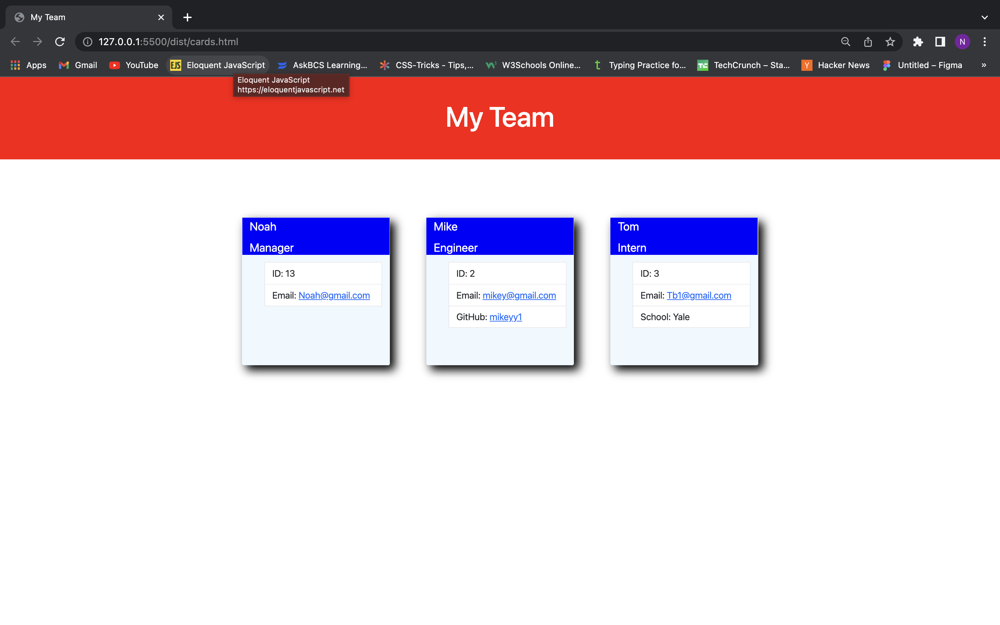

# Note taker app
## Description
allows user to generate informational cards for each employee on a team.

## Installation

- run "npm i" in terminal

## Usage
- run "node index.js" in terminal

## Visuals
 

## Instructional-Video
 https://drive.google.com/file/d/1ETqlvoA14BUfwhP90G5vWurm2JU5XpWy/view

## Questions 

- Github: lilwill13

- noahsfuture18@gmail.com

## Tabel of contents

- [Description](#description)

- [Installation](#installation)

- [Usage](#usage)

- [Visuals](#visuals)

- [Instructional-Video](#instructional-video)

- [Questions](#questions)